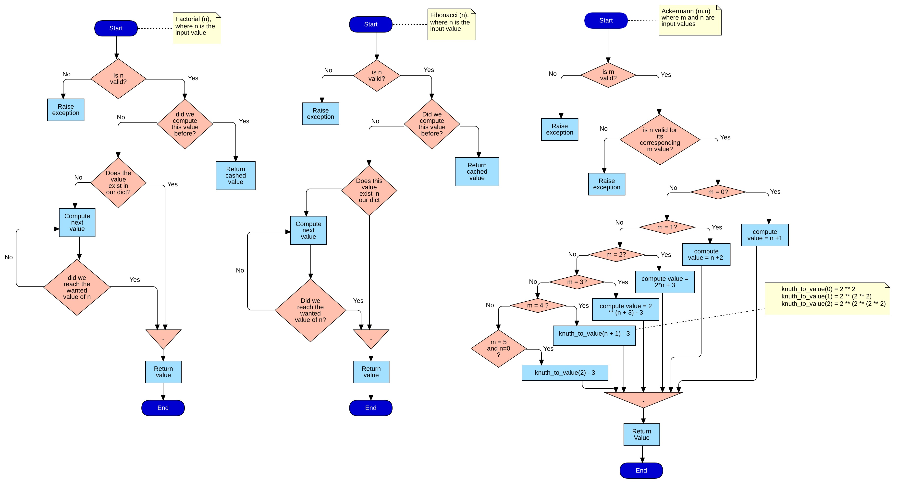

# Assignment (Ahmed Nafies)

This micro-service handles the following:
* Calculating a Fibonacci number F(n) with the value of n provided by the user.
* The Ackermann function A(m,n) with values of m and n provided by the user.
* The factorial of a non-negative integer n provided by the user.



### Built with

[Fast API](https://fastapi.tiangolo.com/) - one the fastest python frameworks according to [techempower.com](https://www.techempower.com/benchmarks/#section=data-r18&hw=ph&test=db&l=zijzen-f) web framework benchmark.

## Install & Run

### using docker

```sh
$ docker-compose up --build
```
server will be running on [localhost:8000](http://localhost:8000)

### without docker

make sure that `pipenv` is installed

Install dependencies
```sh
$ pipenv install
```

run
```sh
$ pipenv run python main.py
```

or run using uvicorn

```sh
$ pipenv run uvicorn main:app
```
Or if you're developing in vscode you can just press `F5` to run the server

server will be running on [localhost:8000](http://localhost:8000)

## Tests

### Running tests with docker

```sh
docker-compose run web pytest 
```

run with coverage
```sh
docker-compose run web pytest --cov
```
### Running tests without docker

```sh
$ pipenv run pytest
```

run with coverage

```sh
$ pipenv run pytest --cov
```

### API documentation

* /docs - Open-API 3.0 (Swagger) documentation
* /redoc - Redoc documentation

### Hint:

Swagger is unable to view large numbers, and thus it shows null instead
e.g Ackermann(4,3), if that is the case, postman is recommended

## Future Improvements

### Monitoring
APM (Application performance monitoring) with ELK (Elasticsearch, Logstash and Kibana)

### CI/CD
CircleCI

### Code documentation
sphinx to generate code documentation and use readthedocs.

### Server
Using nginx as a reverse proxy.
FastAPI supports asynchronicity, so probably it is a good option to take advantage of that

### Testing
Now we have 99% test coverage, AMAZING RIGHT? no it is not.
Mutation testing is recommended here

